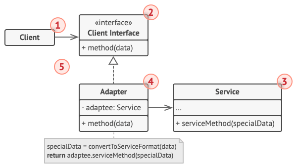

Адаптер — это структурный паттерн проектирования, который позволяет объектам с несовместимыми интерфейсами работать вместе.

Проблема

Представьте, что вы делаете приложение для торговли на бирже. Ваше приложение скачивает биржевые котировки из нескольких источников в XML, а затем рисует красивые графики.

В какой-то момент вы решаете улучшить приложение, применив стороннюю библиотеку аналитики. Но вот беда — библиотека поддерживает только формат данных JSON, несовместимый с вашим приложением.

Структура программы до подключения сторонней библиотеки
Подключить стороннюю библиотеку не выйдет из-за несовместимых форматов данных.

Вы смогли бы переписать библиотеку, чтобы та поддерживала формат XML. Но, во-первых, это может нарушить работу существующего кода, который уже зависит от библиотеки. А во-вторых, у вас может просто не быть доступа к её исходному коду.

Решение

Вы можете создать адаптер. Это объект-переводчик, который трансформирует интерфейс или данные одного объекта в такой вид, чтобы он стал понятен другому объекту.

При этом адаптер оборачивает один из объектов, так что другой объект даже не знает о наличии первого. Например, вы можете обернуть объект, работающий в метрах, адаптером, который бы конвертировал данные в футы.

Адаптеры могут не только переводить данные из одного формата в другой, но и помогать объектам с разными интерфейсами работать сообща. Это работает так:

Адаптер имеет интерфейс, который совместим с одним из объектов.
Поэтому этот объект может свободно вызывать методы адаптера.
Адаптер получает эти вызовы и перенаправляет их второму объекту, но уже в том формате и последовательности, которые понятны второму объекту.

Иногда возможно создать даже двухсторонний адаптер, который работал бы в обе стороны.

Структура программы после применения адаптера
Программа может работать со сторонней библиотекой через адаптер.

Таким образом, в приложении биржевых котировок вы могли бы создать класс XML_To_JSON_Adapter, который бы оборачивал объект того или иного класса библиотеки аналитики. Ваш код посылал бы адаптеру запросы в формате XML, а адаптер сначала транслировал входящие данные в формат JSON, а затем передавал бы их методам обёрнутого объекта аналитики.

Аналогия из жизни

Пример паттерна Адаптер
Содержимое чемоданов до и после поездки за границу.

Когда вы в первый раз летите за границу, вас может ждать сюрприз при попытке зарядить ноутбук. Стандарты розеток в разных странах отличаются. Ваша европейская зарядка будет бесполезна в США без специального адаптера, позволяющего подключиться к розетке другого типа.

 Структура

Адаптер объектов

Эта реализация использует агрегацию: объект адаптера «оборачивает», то есть содержит ссылку на служебный объект. Такой подход работает во всех языках программирования.

Структура классов паттерна Адаптер (адаптер объектов)
Клиент — это класс, который содержит существующую бизнес-логику программы.

Клиентский интерфейс описывает протокол, через который клиент может работать с другими классами.

Сервис — это какой-то полезный класс, обычно сторонний. Клиент не может использовать этот класс напрямую, так как сервис имеет непонятный ему интерфейс.

Адаптер — это класс, который может одновременно работать и с клиентом, и с сервисом. Он реализует клиентский интерфейс и содержит ссылку на объект сервиса. Адаптер получает вызовы от клиента через методы клиентского интерфейса, а затем переводит их в вызовы методов обёрнутого объекта в правильном формате.

Работая с адаптером через интерфейс, клиент не привязывается к конкретному классу адаптера. Благодаря этому, вы можете добавлять в программу новые виды адаптеров, независимо от клиентского кода. Это может пригодиться, если интерфейс сервиса вдруг изменится, например, после выхода новой версии сторонней библиотеки.

Адаптер классов

Эта реализация базируется на наследовании: адаптер наследует оба интерфейса одновременно. Такой подход возможен только в языках, поддерживающих множественное наследование, например, C++.

Структура классов паттерна Адаптер (адаптер классов)
Адаптер классов не нуждается во вложенном объекте, так как он может одновременно наследовать и часть существующего класса, и часть сервиса.
 
Псевдокод

В этом шуточном примере Адаптер преобразует один интерфейс в другой, позволяя совместить квадратные колышки и круглые отверстия.

Структура классов примера паттерна Адаптер
Пример адаптации квадратных колышков и круглых отверстий.

Адаптер вычисляет наименьший радиус окружности, в которую можно вписать квадратный колышек, и представляет его как круглый колышек с этим радиусом.